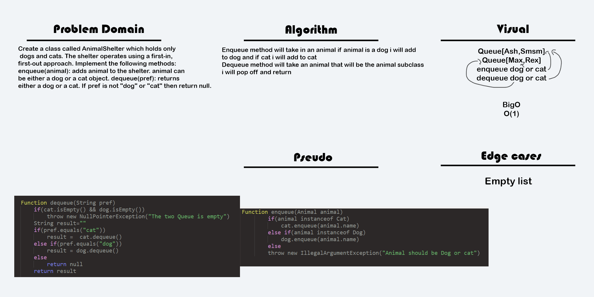

# Data Structures and Algorithms

# Singly Linked List
<!-- Short summary or background information -->
a linked list is a linear collection of data elements whose order is not given by their physical placement in memory. Instead, each element points to the next. It is a data structure consisting of a collection of nodes which together represent a sequence. In its most basic form, each node contains: data, and a reference (in other words, a link) to the next node in the sequence. This structure allows for efficient insertion or removal of elements from any position in the sequence during iteration. More complex variants add additional links, allowing more efficient insertion or removal of nodes at arbitrary positions.

## Challenge
<!-- Description of the challenge -->
Define a method called insert which takes any value as an argument and adds a new node with that value to the head of the list with an O(1) Time performance.
Define a method called includes which takes any value as an argument and returns a boolean result depending on whether that value exists as a Node’s value somewhere within the list.
Define a method called toString (or __str__ in Python) which takes in no arguments and returns a string representing all the values in the Linked List, formatted as:
"{ a } -> { b } -> { c } -> NULL"

## Approach & Efficiency
<!-- What approach did you take? Why? What is the Big O space/time for this approach? -->
- - insert => which takes any value as an argument and adds a new node with that value to the head of the list with an O(1) Time performance. /BigO = 1  
- - incloudes =>which takes any value as an argument and returns a boolean result depending on whether that value exists as a Node’s value somewhere within the list.  /BigO = n
- - toString => which takes in no arguments and returns a string representing all the values in the Linked List, formatted as: /Big O = n

## API
<!-- Description of each method publicly available to your Linked List -->
 

---
---
---


# Stacks and Queues
<!-- Short summary or background information -->
A stack is a data structure that consists of Nodes. Each Node references the next Node in the stack, but does not reference its previous.
Stacks follow these concepts:
FILO
First In Last Out
This means that the first item added in the stack will be the last item popped out of the stack.
LIFO
Last In First Out
This means that the last item added to the stack will be the first item popped out of the stack.
Stack Visualization

Common terminology for a queue is
Enqueue - Nodes or items that are added to the queue.
Dequeue - Nodes or items that are removed from the queue. If called when the queue is empty an exception will be raised.
Front - This is the front/first Node of the queue.
Rear - This is the rear/last Node of the queue.
Peek - When you peek you will view the value of the front Node in the queue. If called when the queue is empty an exception will be raised.
IsEmpty - returns true when queue is empty otherwise returns false.
Queues follow these concepts:
FIFO
First In First Out
This means that the first item in the queue will be the first item out of the queue.
LILO
Last In Last Out
This means that the last item in the queue will be the last item out of the queue.
## Challenge
<!-- Description of the challenge -->
Create a Stack and Queue and writhe (enqueue,dequeue,push,pop,peek,isEmpty) functions.
## Approach & Efficiency
<!-- What approach did you take? Why? What is the Big O space/time for this approach? -->
The desired time/space complexity goals of O(1) and O(n) respectively.
Through online documentation on writing stacks and queues in Java from scratch. I didn't want to rely on an underlying data structure and instead made the class itself into a data structure.

## API
<!-- Description of each method publicly available to your Stack and Queue-->
- - push -> which takes any value as an argument and adds a new node with that value to the top of the stack with an O(1) Time performance.
- - pop -> that does not take any argument, removes the node from the top of the stack, and returns the node’s value.
- - enqueue -> which takes any value as an argument and adds a new node with that value to the back of the queue with an O(1) Time performance.
- - dequeue -> hat does not take any argument, removes the node from the front of the queue, and returns the node’s value.
- - Stack peek -> that does not take an argument and returns the value of the node located on top of the stack, without removing it from the stack.
- - Queue peek -> that does not take an argument and returns the value of the node located in the front of the queue, without removing it from the queue.
- - isEmpty ->that takes no argument, and returns a boolean indicating whether or not the stack or queue is empty

---
---
---


# Challenge Summary
<!-- Short summary or background information -->
Implement a Queue using two Stacks.

## Challenge Description
<!-- Description of the challenge -->
Create a brand new PseudoQueue class. Do not use an existing Queue. Instead, this PseudoQueue class will implement our standard queue interface (the two methods listed below), but will internally only utilize 2 Stack objects. Ensure that you create your class with the following methods:

enqueue(value) which inserts value into the PseudoQueue, using a first-in, first-out approach.
dequeue() which extracts a value from the PseudoQueue, using a first-in, first-out approach.
The Stack instances have only push, pop, and peek methods. You should use your own Stack implementation. Instantiate these Stack objects in your PseudoQueue constructor.


## Approach & Efficiency
<!-- What approach did you take? Why? What is the Big O space/time for this approach? -->
For the enqueue() I pushed onto the back stack internal data structure every time it is called. This achieves an O(1) time and space complexity for the method.
For the dequeue() I treateds the two internal stacks akin to balancing cups, the back stack empties into the front stack every time and then pops the top of that stack. The front queue then immediately returns all of the elements into the back stack. This achieves an O(n) time complexity and an O(1) space complexity for the method.

## Solution
<!-- Embedded whiteboard image -->
 

---

# Challenge Summary
<!-- Short summary or background information -->
Create a class called AnimalShelter which holds only dogs and cats. The shelter operates using a first-in, first-out approach. Implement the following methods: enqueue(animal): adds animal to the shelter. animal can be either a dog or a cat object. dequeue(pref): returns either a dog or a cat. If pref is not "dog" or "cat" then return null.

## Challenge Description
<!-- Description of the challenge -->
My approach was to use to create a superclass of animals that the dog and cat classes would extend to. Then create an animalshelter class that would hold all of the animals in two queues, one for dogs and one for cats. The enqueue method would add new animals to whichever queue they abide by. The dequeue method would go through starting from the front to check if the preferred animal matches and dequeue that animal. My method for adding a node to the queue(enqueue) has a Big O time/space complexity of O(1), however my dequeue method has a time of O(n) and space of O(1).    

## Approach & Efficiency
<!-- What approach did you take? Why? What is the Big O space/time for this approach? -->
* enqueue()

* dequeue()

* [FIFO Animal Shelter](/utilities)


## Solution
<!-- Embedded whiteboard image -->
 

---

# Challenge Summary
<!-- Short summary or background information -->
function should take a string and should return a boolean representing whether or not the brackets in the string are balanced.

## Challenge Description
<!-- Description of the challenge -->
Your function should take a string as its only argument, and should return a boolean representing whether or not the brackets in the string are balanced. There are 3 types of brackets:

Round Brackets : ()
Square Brackets : []
Curly Brackets : {}

## Approach & Efficiency
<!-- What approach did you take? Why? What is the Big O space/time for this approach? -->
Used a stack to hold opening brackets and popped them off the stack when the corresponding closing bracket was found. If the closing brakcet did not match the top node in the stack, then the method would return false. If the stack is not empty in the end after iterating through the entire string input, it would also return false. This operates with a time and space complexity of O(n).

## Solution
<!-- Embedded whiteboard image -->
 

---
---
---


# Trees
<!-- Short summary or background information -->
 a tree is a widely used abstract data type that simulates a hierarchical tree structure, with a root value and subtrees of children with a parent node, represented as a set of linked nodes.

## Challenge
<!-- Description of the challenge -->
* Create a Node class that has properties for the value stored in the node, the left child node, and the right child node.
* Create a BinaryTree class
    * Define a method for each of the depth first traversals called ```preOrder```, ```inOrder```, and ```postOrder``` which returns an array of the values, ordered appropriately.
* At no time should an exception or stack trace be shown to the end user. Catch and handle any such exceptions and return a printed value or operation which cleanly represents the state and either stops execution cleanly, or provides the user with clear direction and output.

* Create a BinarySearchTree class
    * Define a method named ```add``` that accepts a value, and adds a new node with that value in the correct location in the binary search tree.
    * Define a method named ```contains``` that accepts a value, and returns a boolean indicating whether or not the value is in the tree at least once.


## Approach & Efficiency
<!-- What approach did you take? Why? What is the Big O space/time for this approach? -->
I used a recursive approach to my methods to accomplish the feature tasks.
* Time complexity: O(n)
* Space comnplexity: O(n)

## API
<!-- Description of each method publicly available in each of your trees -->
* BinarySearchTree.class
    * BinarySearchTree() // Constructors.
    * add() // Add a node to the tree at the correct location.
    * contains() // Check to see if a given value exists in the tree.
*  BinaryTree.class
    * BinaryTree() // Constructors.
    * preOrder() // Return an array of the values in pre-order.
    * inOrder() // Return an array of the values in in-order.
    * postOrder() // Return an array of the values in post-order.
    * isEmpty() // Checks to see if the tree is empty.
    * getRoot() // Returns the value at the root node.

---
---
---