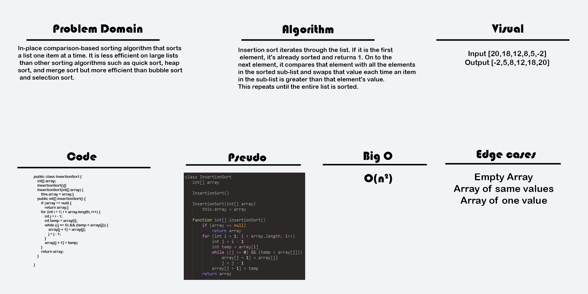

# Blog Notes: Insertion Sort
Insertion Sort is an in-place, comparison-based sorting algorithm, it is efficient when working with small numbers of elements.
It mimics the way that humans sort decks of cards in their hands and this is often the example given to help newcomers visualize it in practice.
It is not suitable for a data set greater than 100 elements as it quickly becomes inefficient. 
In spite of its quadratic time complexity it sorts a given data set in place and maintains 
constant space complexity as a result, unlike merge sort which requires additional space.
Of note is that elements are shifted to the right as opposed to being swapped in order to 
free the space for the lesser value element to be inserted.

## Learning Objectives
* The primary focus of this blog post is to explore and explain the nuances of the insertion method of sorting algorithms.
* Pros and cons of insertion sort 
* Visualization of the algorithm at work

## Information Flow
* Insertion sort is worthwhile to know but not an essential algorithm to memorize:
    * Only dealing with data sets of 100 elements or smaller is not realistic in modern, real-world programming scenarios
* With that in mind there could still be unique cases that present themselves where this is the optimal approach:
    * As an example; sorting a user's top 50 most played songs on a music streaming app, 
    size will always be controlled for and the list will need to frequently be resorted without incurring space costs.
## Diagram
* 


## Algorithm
* Step 1 − If it is the first element, it is already sorted. return 1;
* Step 2 − Pick next element
* Step 3 − Compare with all elements in the sorted sub-list
* Step 4 − Shift all the elements in the sorted sub-list that is greater than the value to be sorted
* Step 5 − Insert the value
* Step 6 − Repeat until list is sorted

## Pseudocode
```
 InsertionSort(int[] arr)
  
    FOR i = 1 to arr.length
    
      int j <-- i - 1
      int temp <-- arr[i]
      
      WHILE j >= 0 AND temp < arr[j]
        arr[j + 1] <-- arr[j]
        j <-- j - 1
        
      arr[j + 1] <-- temp
```